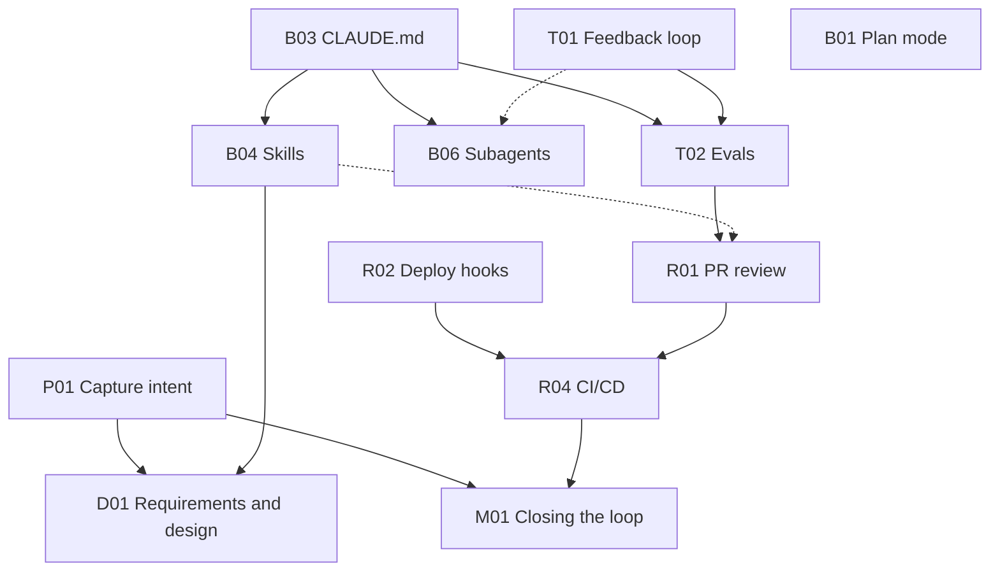

# Source dependencies and adoption order

Source: [Anthropic playbook](https://claude.com/blog/the-ai-native-sdlc-playbook), captured in [the source snapshot](sources/anthropic-playbook.md). IDs map to [coverage](COVERAGE.md). These are adoption dependencies, not execution-stage order. Infrastructure is recorded separately in [prerequisites](PREREQUISITES.md).

**Scope note:** this document transcribes the full source, not today's execution prerequisites. The user has explicitly deferred evaluations, approval enforcement, delivery and maintenance. Follow [WORKFLOW.md](WORKFLOW.md) for the current engineer-led handoffs; no evaluation runner is needed before local review.

## Written prerequisites

| ID | What the source actually says |
| --- | --- |
| P01 | None. |
| D01 | Accepted intent; brand, security, compliance and UX policies expressed as skills. |
| B01 | Intent/spec **if one exists**; CLAUDE.md **helps**. The full lifecycle's execution narrative starts from an approved spec. |
| B02 | No dedicated prerequisite block. An approved plan and mature context, skills, guardrails and runnable tests are operating conditions for routine auto-mode work. |
| B03 | None. |
| B04 | None required. CLAUDE.md helps but a skill explicitly does **not** depend on it. |
| B05 | No dedicated prerequisite block. Hooks back policies that must hold; fast scoped checks belong in the inner loop. |
| B06 | CLAUDE.md required; feedback loop **helps**. Git/worktrees and suitable permissions are infrastructure. |
| T01 | None. |
| T02 | CLAUDE.md and feedback loop. |
| R01 | Updated CLAUDE.md; skills **if** review enforces written policies; defined subagents. Evals are not in this written prerequisite list. |
| R02 | None. A written list of required approvals is infrastructure. |
| R03 | Worked example, not a separate play with prerequisites. Platform/IT deploys managed settings. |
| R04 | PR-review loop and approval hooks before accelerated automation. |
| M01 | Intent format, PR review, hooks as action boundary, and the CI/CD rollback path. |
| M02 | PR-review gate and approval hooks; intent format for findings larger than a PR. |
| M03 | No dedicated prerequisite block. Supported incident channel, Tag access, MCP access, review/release boundaries and recovery verification are operating requirements. |
| X01 | No dedicated prerequisite block; applies to every artifact. |
| X02 | No dedicated prerequisite block; committed artifacts and accountable human decisions connect the entire lifecycle. |

“None” means the source explicitly says none. “No dedicated prerequisite block” does not mean a capability works without infrastructure.

## Diagram transcription

[Original adoption diagram](https://cdn.prod.website-files.com/68a44d4040f98a4adf2207b6/6a8855c75344623fc81efcb8_5d5a3c05.png), visually inspected during the source audit. Twelve nodes, eleven solid arrows and two dotted arrows are visible. The diagram omits seven coverage IDs; it is not the full inventory.

The diagram's start-anywhere nodes are P01, B03, T01, R02 and B01. No other arrows are implied here. The source gives no formal legend for dotted arrows; the prose calls the associated relationships helpful or conditional.

## Source discrepancies and implementation treatment

1. **Skills:** the graph has B03 → B04, while prose explicitly says skills do not depend on CLAUDE.md. Preserve both. This package establishes CLAUDE.md before adding skills, which satisfies either ordering; it does not claim this is a universal technical dependency.
2. **PR review:** the graph has T02 → R01; prose names CLAUDE.md, conditional skills and defined subagents, not evals. Preserve the discrepancy. The earlier choice to enforce the union of both prerequisite lists is superseded by the user's workflow-only scope: local review can proceed without T02. This does not claim the entire integrated source play has been implemented.
3. **Maintenance:** the diagram's R01/R02 dependencies are transitive through R04, while prose lists them directly. Both require the controls; do not infer that maintenance bypasses review or hooks.
4. **Plan mode:** its root placement is compatible with adoption before an intent/spec exists. The complete artifact chain still uses approved intent and spec. Do not invent a D01 → B01 adoption arrow to describe an execution handoff.
5. **Human review:** R01's infrastructure calls branch protection worthwhile, while execution and governance require human code-owner approval. Those are source requirements for the complete play. Current local review produces findings for engineer judgement; formal approval enforcement is deferred, and existing repository rules are not bypassed.
6. **Source of truth:** the preferred model has one authority per artifact. The source also explicitly permits linked dual records as a transitional minimum. The artifact contract retains that option and its drift risk.

The source transcription is unchanged. The user's explicit deferrals are recorded in [future work](../FUTURE_WORK.md), separately from source interpretation and [product compatibility](COMPATIBILITY.md).

## Source execution handoffs, not current enforced gates

In the full source, accepted `intent.md` starts requirements/design; approved `spec.md` starts plan mode; the engineer's accepted plan permits implementation; merged PR starts delivery; an operational signal produces new intent. The current workflow retains artifact continuity and ordinary engineer decisions, not an implementation of all those integrations or independently enforced gates.
